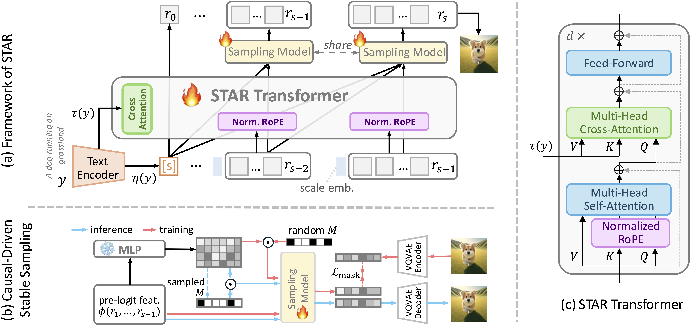
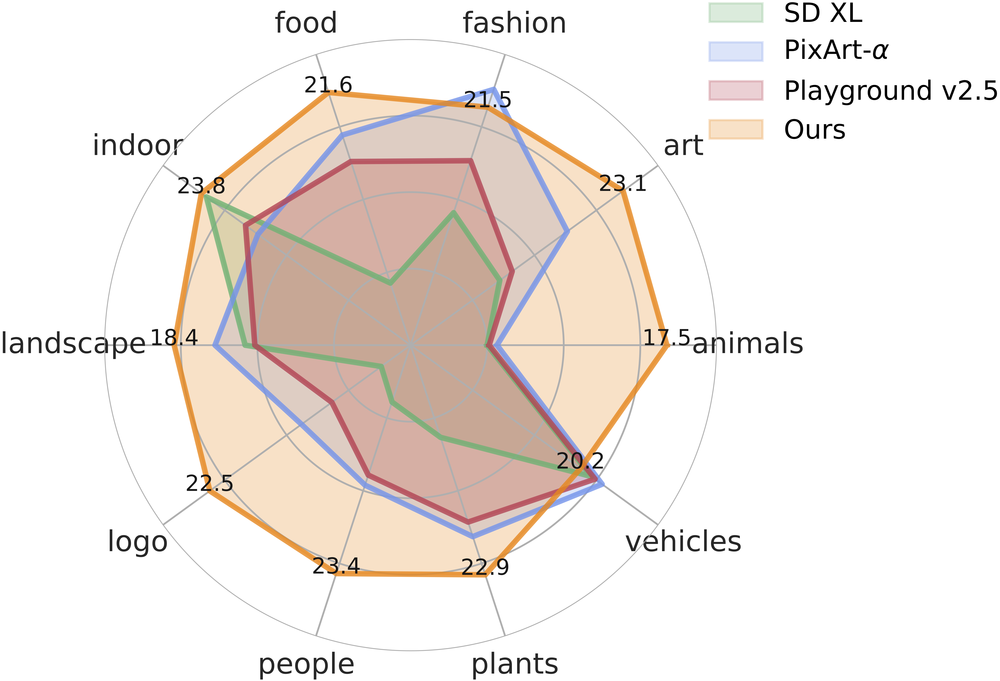
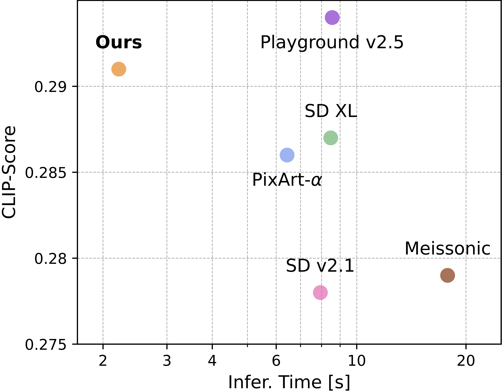

<div align="center">
    <h1> 
        <span style="color:rgb(255, 242, 140);">S</span>cale-wise 
        <span style="color:rgb(255, 242, 140);">T</span>ext-conditioned 
        <span style="color:rgb(255, 242, 140);">A</span>uto<span style="color:rgb(251, 228, 134);">R</span>egressive image generation
    </h1>
</div>


[](https://arxiv.org/abs/2406.10797)&nbsp;
[](https://huggingface.co/taocrayon/STAR)&nbsp;
[](https://github.com/DavinciXLab/STAR-T2I)&nbsp;


# News

- [2025-02] We have released official [Codebase](https://github.com/DavinciXLab/STAR-T2I) and weights at [Hugging Face](https://huggingface.co/taocrayon/STAR)!
- [2024-06] STAR [Technical Report](https://arxiv.org/abs/2406.10797) is released.

#  Introduction
<!-- STAR, a novel scale-wise text-to-image model, is the first to extend the category-based VAR model from a 256-pixel resolution to a 1024-pixel resolution for text-to-image synthesis. -->
<b><font color="color:rgb(255, 242, 140)">STAR</font>, the first scale-wise text-to-image model based on VAR, supports resolutions from 256×256 to 1024×1024.

By incorporating text conditioning, normalized 2D RoPE, and causal-driven stable sampling, STAR outperforms existing models in fidelity, consistency, and quality, with a faster generation speed of 2.21s for 1024×1024 images on an A100.</b>


<div align="center">

</div>
</div>

<details><summary><b>CLICK for Detailed Introduction & Architecture</b></summary>
Unlike VAR, which focuses on a toy category-based auto-regressive generation for 256 images, STAR explores the potential of this scale-wise auto-regressive paradigm in real-world scenarios, aiming to make AR as effective as diffusion models. To achieve this, we: 
+ replace the single category token with a text encoder and cross-attention for detailed text guidance;
+ introduce cross-scale normalized RoPE to stabilize structural learning and reduce training costs, unleasing the power for high-resolution training; 
+ propose a new sampling method to overcome the intrinsic simultaneous sampling issue in AR models. While these approaches have been (partially) explored to diffusion models, we are the first to validate and apply them in auto-regressive image generation, resulting in high-resolution, text-conditioned synthesis and can get StableDiffusion 2 performance.

<div align="center">

<p>framework of STAR</p>
</div>
</details>

### Quantitative Performance

<table style="border-collapse: collapse;">
  <tr>
    <td style="text-align: center; border: none;">
      
      <br>
      <small>Per-category FID on MJHQ-30K</small>
    </td>
    <td style="text-align: center; border: none;">
      
      <br>
      <small>Efficiency & CLIP-Score of 1024x1024 generation</small>
    </td>
  </tr>
</table>

### Qualitative Performance
<div style="text-align: center; width: 100%;">
    
</div>

<!-- ### More Ablations -->

# Reproduction
See [Repo](https://github.com/DavinciXLab/STAR-T2I) for detailes.

# Citation
Thanks to the developers of [Visual Autoregressive Modeling](https://arxiv.org/abs/2404.02905) for their excellent work. Our code is adapted from [VAR](https://github.com/FoundationVision/VAR).
If our work assists your research, feel free to give us a star ⭐ or cite us using:
```
@article{ma2024star,
  title={STAR: Scale-wise Text-conditioned AutoRegressive image generation}, 
  author={Xiaoxiao Ma and Mohan Zhou and Tao Liang and Yalong Bai and Tiejun Zhao and Biye Li and Huaian Chen and Yi Jin},
  journal={arXiv preprint arXiv:2406.10797},
  year={2024}
}
```